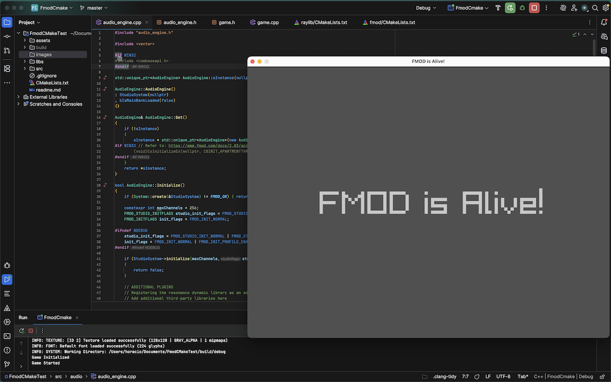

# FmodCMake

A CMake template project that demonstrates integration of Firelight Technologies' FMOD audio engine with any software project.

## Overview

This project showcases a basic integration between FMOD and raylib, featuring:
- A simple raylib window application
- FMOD audio engine integration
- Background music playback by playing an audio event from a soundbank
- A basic audio engine class to interface between FMOD and the rest of the codebase
- A .ini config file and a simple config parser to handle audio initialization

## Prerequisites

- CMake 3.x or higher
- FMOD Studio and FMOD Core API
- raylib development libraries (included)
- C++20 compatible compiler.

## Building the Project

1. Clone or download the repository
2. Copy the FMOD API and the libraries for your target platform
3. Configue the project by using the command line or an IDE
4. Build using your favorite IDE and compiler

### CMake build commands:

Open the project directory and write one of these command examples based on your platform and required configuration.
Note that some IDEs can configure and build your project without using the command line.

- cmake -B build/debug -DCMAKE_BUILD_TYPE=Debug -G "Visual Studio 17 2022"
- cmake -B build/debug -DCMAKE_BUILD_TYPE=Debug -G Xcode
- cmake -B build/release -DCMAKE_BUILD_TYPE=Release -G "Unix Makefiles"

## Project Structure

- `CMakeLists.txt` - Main CMake configuration file
- `assets/` - Contains soundbanks and general assets
  - `soundbanks/` - Master.bank, Master.strings.bank and Music.bank
- `config/` - Contains a configuration file for the audio engine
- `libs/` - Contains all "third-party" libraries for the project
  - `raylib/`
    - `include` - raylib header files
    - `lib` - raylib dynamic and static libraries
    - `CMakeLists.txt` - CMake configuration file for raylib
  - `fmod/`
    - `core` - FMOD Core header files and static and dynamic libraries
    - `plugins` - Additional FMOD custom plugins (google resonance included)
    - `studio` - FMOD Studio header files and static and dynamic libraries
    - `CMakeLists.txt` - CMake configuration file for FMOD
  - `CMakeLists.txt` - File that exposes the libraries to the main configuration file
- `src/` - Source code directory

## Official Documentation and Helpful Links

FMOD - Studio API Getting Started\
https://www.fmod.com/docs/2.03/api/studio-api-getting-started.html

raylib\
https://github.com/raysan5/raylib

CMake\
https://cmake.org/

CMake Projects in Visual Studio\
https://learn.microsoft.com/en-us/cpp/build/cmake-projects-in-visual-studio?view=msvc-170

Create a CMake hello world project in VS Code\
https://code.visualstudio.com/docs/cpp/cmake-quickstart

Xcode generator in CMake\
https://cmake.org/cmake/help/latest/generator/Xcode.html
